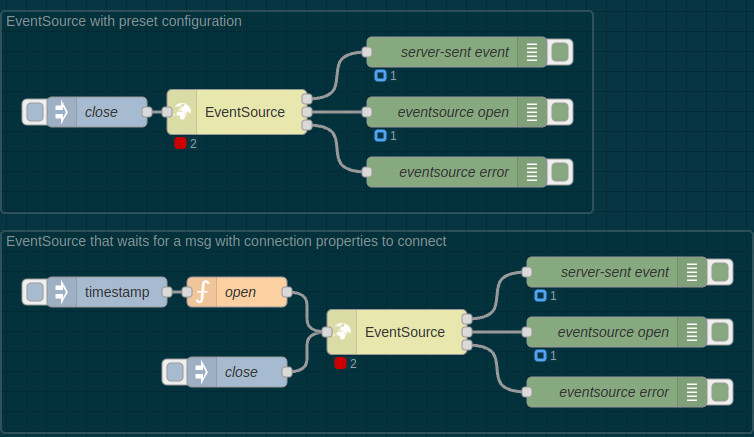

# @parasaurolophus/node-red-eventsource

Wrap the [eventsource](https://www.npmjs.com/package/eventsource) package for
use with [Node-RED](https://nodered.org)



Used by a personal home automation flow:
<https://github.com/parasaurolophus/home-automation>

Tested with Node-RED 3.1 on Node.js 20.x. May not be compatible with earlier
versions.

See:

- <https://github.com/EventSource/eventsource>
- <https://html.spec.whatwg.org/multipage/server-sent-events.html#server-sent-events>
- <https://github.com/parasaurolophus/home-automation>

## Overview

An `EventSource` node listens for event messages sent asynchronously by a
server, forwarding them as they arrive to other nodes downstream in a flow.


The SSE (Server-Sent Event) and life-cycle state messages are as described by
<https://html.spec.whatwg.org/multipage/server-sent-events.html#server-sent-events>

## Node Properties

If a URL is set in the node settings dialog, the node will attempt to connect
automatically each time the flow is (re-)started. Such a node will still respond
to messages sent to its input port as described in the next section. The URL may
be specified as a static string or with embedded references to environment
variables.

The node settings also includes a property named `initDict` whose value is
passed as the second parameter to the wrapped `EventSource` constructor. It can
be specified using JSON or JSONata.

## Inputs

_Note: Any parameters passed in an incoming message will override the
corresponding properties specified via the node's settings dialog._

If `msg.payload` is an object with a `url` property and, optionally, an
`initDict` property then this node uses `new EventSource(msg.payload.url,
msg.payload.initDict)` to wrap a newly created `eventsource` instance. The
`initDict` defaults to an empty object (`{}`) if it is not supplied in
`msg.payload`. A common use of `initDict` is to pass authentication tokens to
`EventSource` services that require them.

Otherwise, if `msg.payload` is not an object or does not have a `url` property
then this node calls the `eventsource.close()` method of the wrapped instance,
if it exists. If a subsequent message is received, any current connection will
be closed before attempting to establish a new connection.

## Outputs

1. Asynchronous stream of server-sent event objects
2. Asynchronous stream of `EventSource.onopen` life-cycle
   messages
3. Asynchronous stream of `EventSource.onerror` life-cycle
   messages

### Output 1: Server-Sent Events

Each server-sent event object emitted from the first output will have
`msg.payload.type` and `msg.payload.data` fields and `msg.topic` set to
`"message"`. The content and format of the `type` and `data` properties are
determined by the server:

```json
{
  "topic": "message",
  "payload": {
    "type": "<...some string...>",
    "data": "<...message body...>"
  }
}
```

The default value for the `type` field defined by the
[WHATWG](https://html.spec.whatwg.org/multipage/server-sent-events.html#server-sent-events)
specification is `"message"` but can be set to (almost) any string for a given
event sent by a given server. The value of the `data` field may be anything that
can be encoded in a HTTP response message but is often the HTML, JSON or XML
encoded representation of some "entity."

### Output 2: onopen

The second output will emit the objects sent to the `EventSource.onopen`
handler. Each such object will have `msg.topic` set to `"open"` and
`msg.payload` will be the value passed to the handler.

### Output 3: onerror

The third output will emit the objects sent to the `EventSource.onerror`
handler. Each such object will have `msg.topic` set to `"error"` and
`msg.payload` will be the value passed to the handler. See
<https://github.com/EventSource/eventsource#http-status-code-on-error-events>
for information on the payload content. As with `EventSource.onopen` events, the
exact `msg.payload` here is usually of limited usefulness due to issues with the
design and implementation of both the _WHATWG_ specification and the underlying
_EventSource_ library package wrapped by this node. What is of interest, again,
is that receipt of any event of this type indicates that the connection is
experiencing (hopefully transient) issues and the underlying library package is
still attempting to automatically (re-)connect.

## Details

This is a deliberately minimalist implementation of the protocol and JavaScript
interface underlying the standard _EventSource_ feature available in modern web
browsers. An aspect of the "minimalist" philoosophy is that an instance of
`EventSource` wrapped by this node will automatically subscribe to and forward
to the node's output **all** messages sent by the server, using an
`EventSource.onmessage` handler. (In particular, it makes no attempt to expose
the more fine grained `EventTarget.addEventListener(type, handler, ...)`
interface.) To start receiving events, send a message with URL and configuration
parameters in its payload as described above. The `EventSource` node will open a
connection and begin emitting event messages asynchronously as they are sent by
the server.

The `status.text` of the `EventSource` node can be used to track the state of
the connection:

| `status.text` | Description                                                                                     |
| ------------- | ----------------------------------------------------------------------------------------------- |
| `-1`          | The `eventsource` client object has not yet been created since the flow was last (re-)started   |
| `0`           | The `eventsource.readyState` value indicating the client is attempting to connect to the server |
| `1`           | The `eventsource.readyState` value indicating the client is currently connected to the server   |
| `2`           | The `eventsource.readyState` value indicating the connection has failed                         |

The `EventSource` node's status will oscillate between 0 and 1 as the wrapped
`eventsource` instance attempts to stay connected. If the status reaches 2,
there will be no more attempts to reconnect automatically. You will need to send
another `msg` to the `EventSource` node's input in order to resume receiving
server-sent events. The `onopen` and `onerror` life-cycle messages described
above are emitted along the way.
